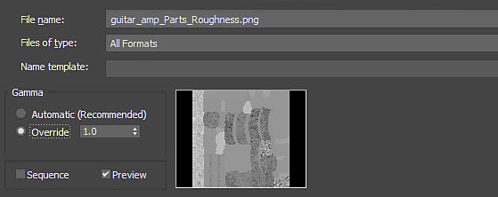

# Substance textures in 3ds Max

The Substance in 3ds Max plugin takes care of the the gamma setting for outputs.

When importing textures, you will need to set the Gamma to Override1.0 for images that represent non-color data such as metallic, roughness, normal, height and displacement.

