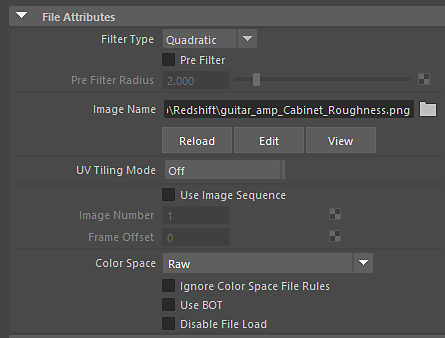

# Substance textures in Maya

The color space you set for maps depends on the settings and rules established in the [Maya Color Management Settings](https://help.autodesk.com/view/MAYAUL/2020/ENU/?guid=GUID-B260195C-A0FE-4F51-9EA2-099B61B7725A).

The Substance in Maya plugin is set to "Ignore Color Space File Rules" on the File Node. The plugin takes care of the Color space setting regardless of Color Management using the following:

BaseColor, Diffuse, Emissive, Specular = sRGB  
Normal, height, displacement, roughness, metallic = RAW

Typically, you will need to set the Color Space to RAW for images that represent non-color data. However, this setting can be affected by the rules you have set in Color Management.

