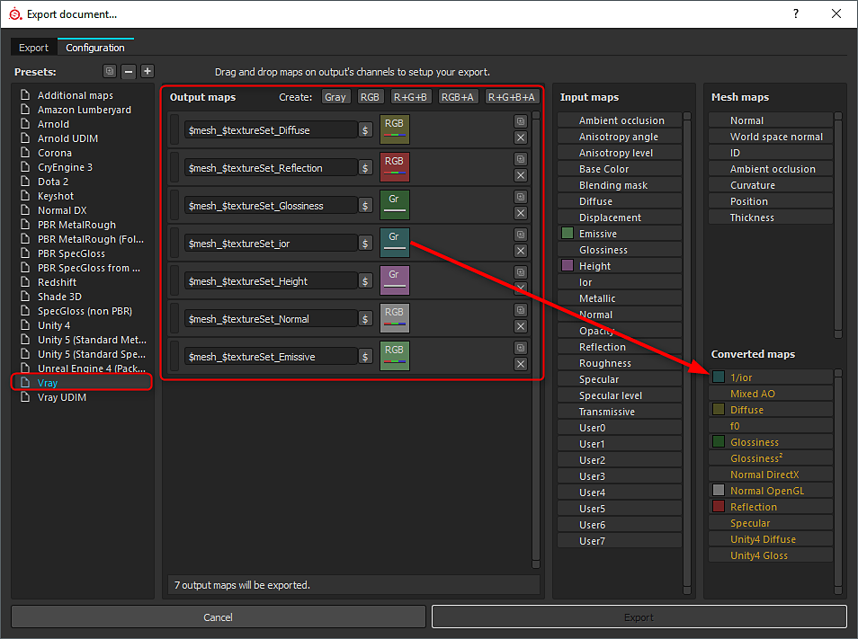
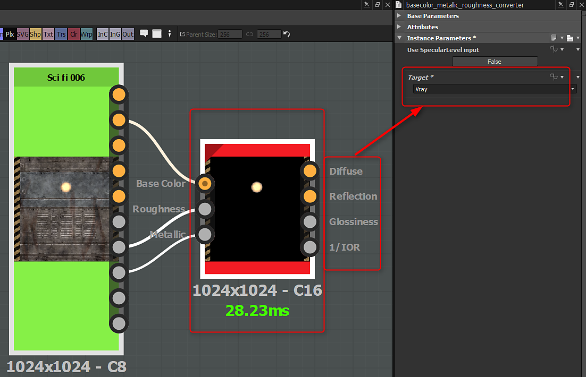

# Converting Substance outputs

## Substance Painter

You can export the converted maps from Substance Painter. A wide range of render presets are supported and simply selecting a preset will convert the maps types. (conversion is based on the metal/rough workflow).

{width="800px"}

## Substance Plugin

The Substance plugin will generate outputs and automatically create materials for specific workflows. However, with DCC applications and 3rd-party renderers, you may need to manually convert the metallic/rough outputs. The following integrations support automatic rendering workflows and will appropriately convert any map types if needed:

* [Substance in Maya](../../3d-applications/maya/using-workflows/using-workflows.md)
* [Substance in 3ds Max](../../3d-applications/3ds-max/3ds-max.md)

## Custom Substances

If you are building a custom Substance, you can create the specific outputs you need for renderers such as Vray and Corona. Using the metallic/roughness conversion node (Library&gt;PBR Utilities), You can easily convert the base color, roughness and metallic maps to the specific renderer.

{width="600px"}
