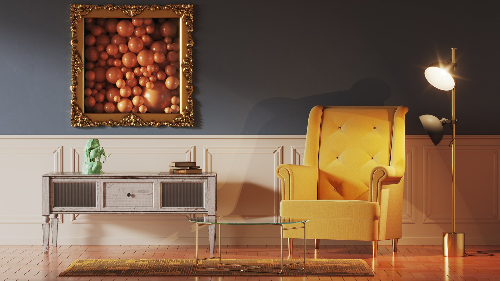
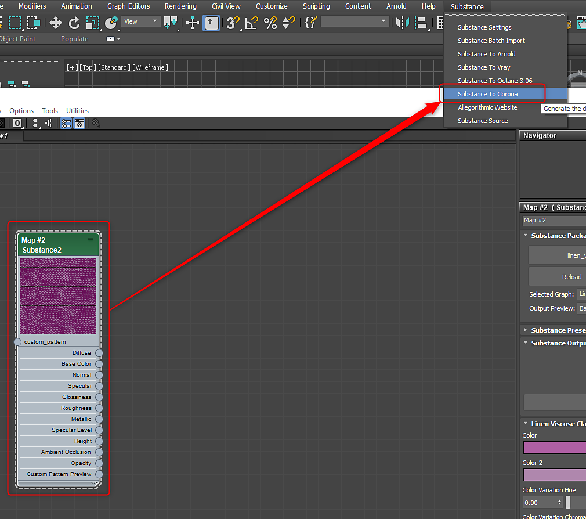

# Corona for 3ds Max

## Substance in Maya Plugin

## Corona 1.6 - 6

Using the[ 3ds Max plugin](../../../3d-applications/3ds-max/3ds-max.md), you can choose Corona in the Substance menu to automatically setup the Corona material with Substance texture inputs.

{width="500px"}

## Corona 7 - 9

For Corona render 7 and above, selecting "Substance to Corona" with the Substance2 node selected will create a network for the Corona Physical Material.

* **LiftGamaGain** is created between the Base Color output and Base color input. A Gamma value of 0.455 is used to correct color difference.
* **CoronaNormal** is created between the Normal output and Base bump input, and also between the Coat Normal output and Clearcoat Bump input. No settings are changed, but modifications for normal can be made here.
* **CoronaMix** is created between the Sheen Color output and Sheen color input. A Mix Amount of 0 is set and a multiplier of 2 is set for the Base Layer. Users can adjust the Mix Amount value to control sheen.
