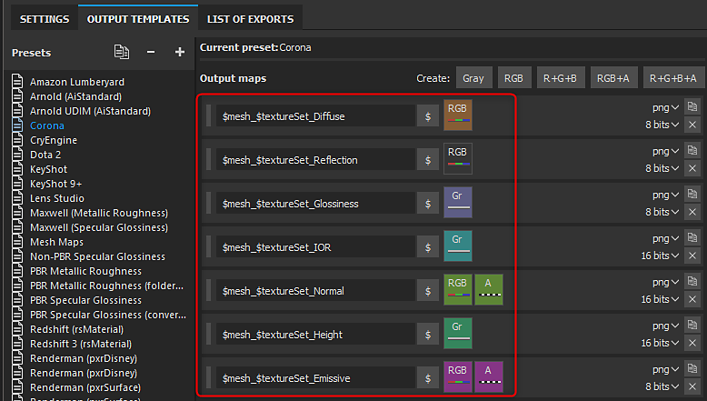

# Corona - Substance Painter

For rendering with Corona you can use maps exported from Substance Painter or the Substance plugin. Corona is using the Specular/Glossiness workflow with a 1/IOR map. You will need the following maps:

* Diffuse
* Reflection (Specular)
* Glossiness
* 1/IOR (Converted)

Using the Corona Output Template, Substance Painter will export the converted map types needed.

>[!NOTE]
>
> Maps that represent data will need to be interpreted correctly. Please see the [Color Management ](../../../renderers/color-management/color-management.md)page for more information.
