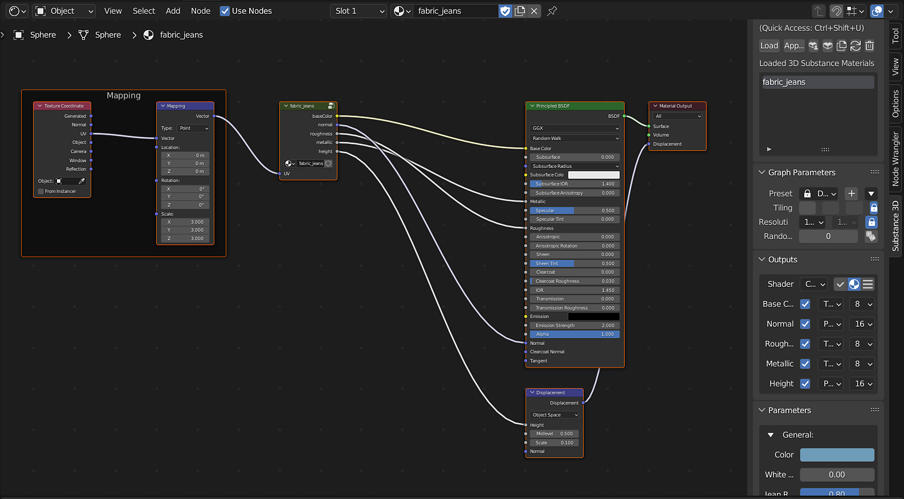

# Cycles and Eevee - Substance 3D for Blender

With the [Substance 3D for Blender](../../../3d-applications/blender/blender.md) plugin, using the **Load** button to select a .sbsar file will create a Blender material with the grouped outputs connected to a Principled BSDF node.  
The displacement setting for the material created is automatically set to "Displacement and Bump".

