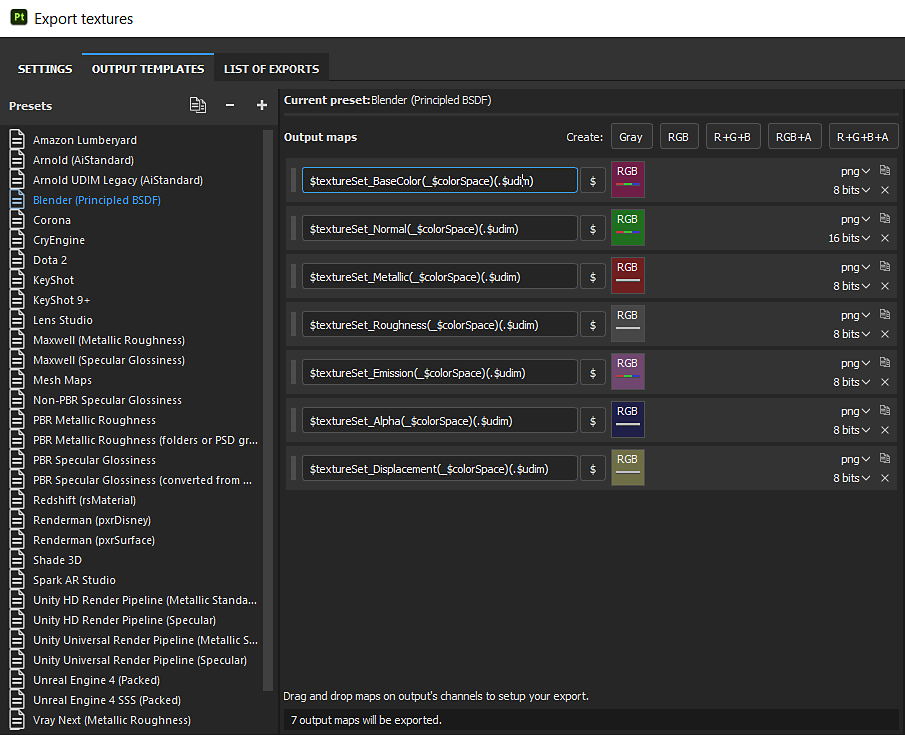

# Cycles and Eevee - Susbtance Painter

A custom template can be made for exporting textures to Blender.

1. With the PBR Metal Roughness template selected, click the Duplicate button to make a copy.
1. Change the Normal type on the copy from DirectX to OpenGL by dragging the option from Converting Maps to the Normal RBG square and selecting "From RBG".
1. Rename the Preset if desired

>[!NOTE]
>
> Maps that represent data will need to be interpreted correctly. Please see the [Color Management ](../../color-management/color-management.md)page for more information.
