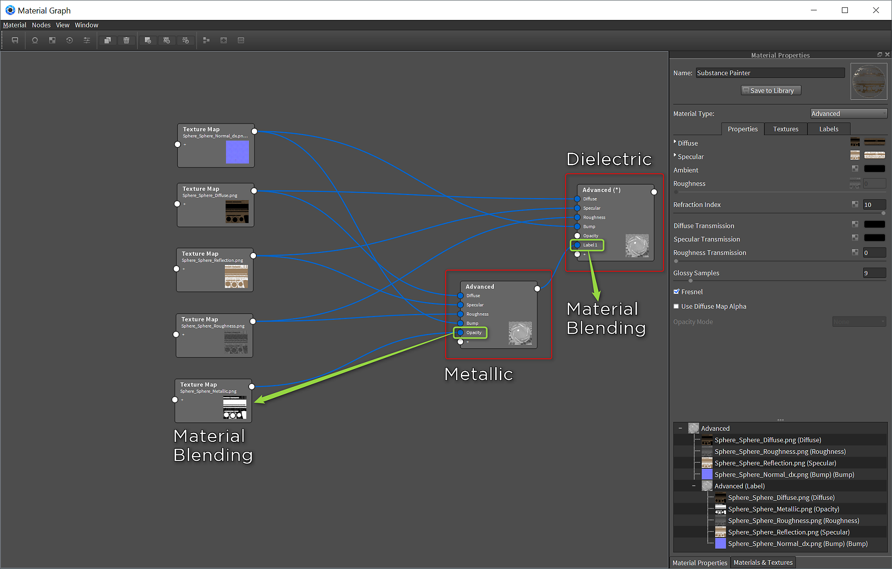

# Keyshot

*Keyshot 6.1.72*[Download Example Scene](https://www.dropbox.com/s/rvjsbbcx7c74aah/keyshot.zip?dl=0)

## Substance Painter Export

1. For Keyshot, you will need to configure an export preset using Diffuse, Reflection, Metallic, Roughness and Normal (direct X).

   

## Advanced Material Setup

You will use 2 advanced materials. One will be for metallic and the other will be for dielectric.

1. Set your material to Advanced and graph the material.   
     
   **Metallic:**  
   a. Set the Refraction Index to 10  
   b. Set the maps as indicated in the table below

   | Substance Painter texture | Advanced Material Channel |
   | --- | --- |
   | Diffuse | Diffuse |
   | Metallic | Opacity |
   | Normal | Bump \*Normal Enabled |
   | Roughness | Roughness |
   | Reflection | Specular |

1. Create a new Advanced Material  
     
   **Dielectric:**  
   a. Set the Refraction Index to 1.5  
   b. Set the maps as indicated in the table below

   | Substance Painter texture | Advanced Material Channel |
   | --- | --- |
   | Diffuse | Diffuse |
   | Normal | Bump \*Normal Enabled |
   | Roughness | Roughness |
   | Reflection | Specular |

1. Take the output of the Metallic Advanced Material and add it to the + of the Dielectric Advanced Material. This will create a Label field on the material.

   
