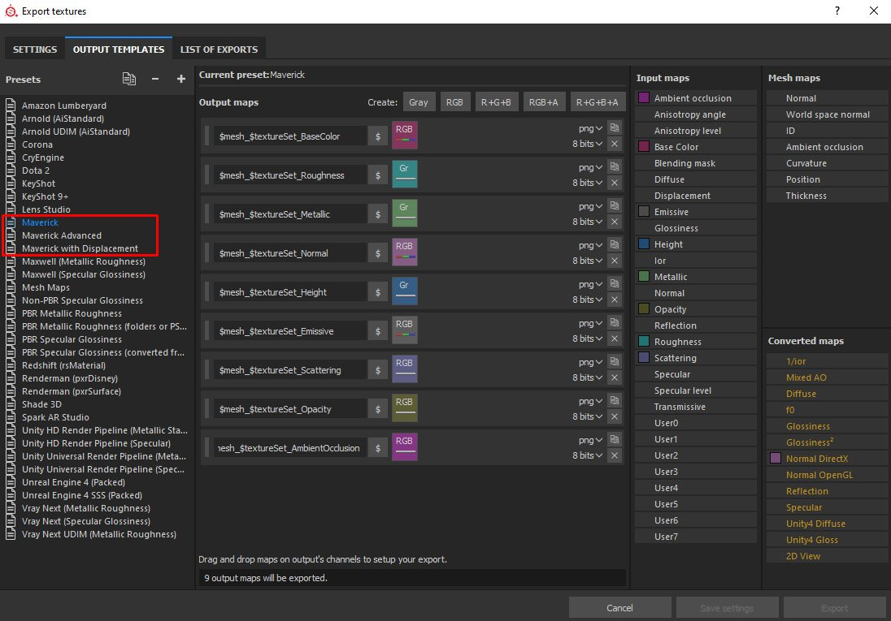
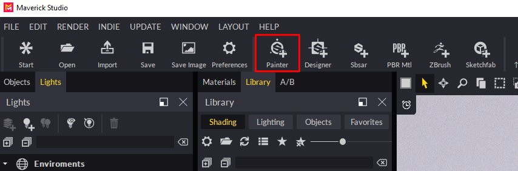
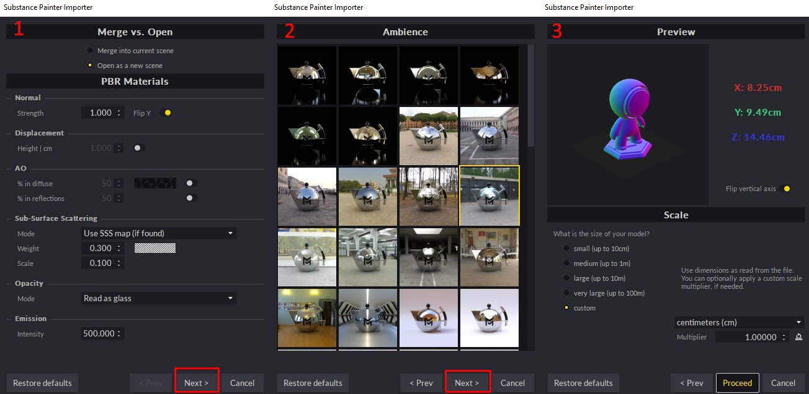

# Substance Painter Integration

>[!NOTE]
>
> **Info**
> 
> Important: Please, add our presets to the Substance Painter installer.  
> You can download those 3 presets from here:  
> <https://www.dropbox.com/s/11vuk0k0ob772mv/Maverick_Export_Pre>[sets.zip](https://www.dropbox.com/s/11vuk0k0ob772mv/Maverick_Export_Presets.zip)

You can easily bring your Substance Painter project into Maverick by following these steps:

**In Substance** **Painter****:**

1. Export your mesh.
1. Export your textures in the same folder where there mesh is, using one of the Maverick presets (view image):

   

   *Choose* *“**Maverick**preset**” in the* *general* *case.*

   *Choose* *“**Maverick* *Advanced* *preset**” if* *you've**painted* *a* *specific**map**such* *as* *anisotropy* *or* *coating**.*

   *Choose* *“**Maverick**with**Displacement**preset**” if* *your* *model has a relevant* *displacement**map**. This* *preset**will* *export the* *height**map**in**32-bit for* *Maverick* *to capture all the high-**quality**geometry**details**.*

   **In** **Maverick****:**
1. Click the Substance Painter Icon:

   
1. Select the mesh file you exported from Substance Painter.
1. Follow the instructions in the Import dialog:

   * In the first dialog page you can set some material parameters.
   * In the second dialog page you can choose the ambience where your model will appear.
   * In the third dialog page you can choose the scale and axis orientation of your model.

   
1. Proceed and you will get your model correctly organized by texture set and with its materials automatically created and applied. All ready for the lighting phase.

   **If** **you****modify****your** **textures in Substance** **Painter****, export** **them****again****,** **overwriting** **the** **previous****ones****.** **Then****, in** **Maverick****, use the Update** **Maps****icon****:**

   {width="800px"}

   You can see the full process in the following video tutorial:

   [**https://youtu.be/vw2RPGjPhh8**](https://youtu.be/vw2RPGjPhh8)
