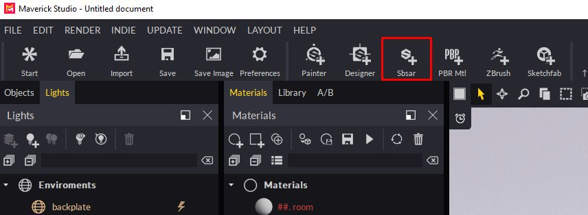
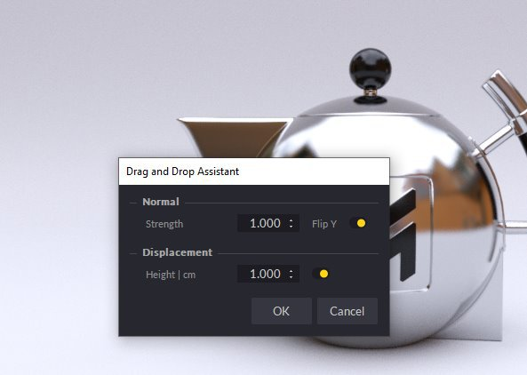
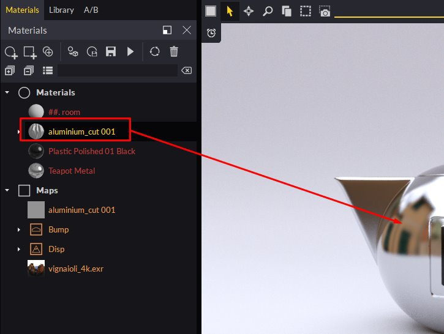
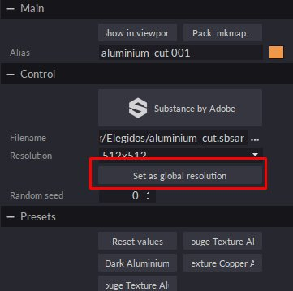
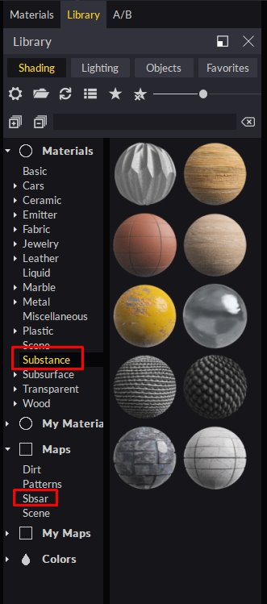

# Substance SBSAR Integration

**You can** **easily****bring** **SBSAR files** **created** **in Substance Designer or Substance** **Alchemist** **to** **Maverick****following****either** **of** **these** **2** **methods****:**

**Method** **1:**

1. Use the SBSAR icon and select your SBSAR file.

   
1. In the Import dialog you can set some material parameters:

   
1. Proceed and you will see your material appear in the Materials panel, ready to be used in your scene:

   

   **Method** **2****:**
1. Simply drop your SBSAR file from the Windows Explorer to any object in the scene. You can drop SBSAR files on the Material panel too.
1. In the Import dialog you can set some material parameters:

   
1. The material will be applied to the object you dropped on.

   **Tips &amp; Tricks :**
1. You can edit the SBSAR parameters by selecting the Substance node in the Materials panel or by clicking on one of the material’s channel plugs.
1. We recommend that you edit the material at a resolution of 512 or 1024 to make editing more fluid. For final renders you can increase the resolution to 2048 or 4096.
1. If you want to use the same SBSAR but with different parameters on another object in the scene, duplicate it and apply it to the new object. Maverick will automatically create a new material that you can edit independently.
1. If you have several SBSARs on scene you can use the button “Set as global resolution” in any of them to control the resolution of all of them at once.

    
1. Maverick includes 10 Materials and SBSARs that you can find in the Shading library under the Materials/Substance and under Maps/Sbsar folders:

    
1. If you want to make your own SBSARs available to Maverick, create a sub-folder to place them in

    “C:\Users\User\Documents\RandomControl\library\Shading\My Maps”.

    Then, you can simply drop them over your objects so that Maverick can create the corresponding wrapper material.

    You can see an introduction video for SBSAR in Maverick here: <https://youtu.be/HosZOoMRfcM>

    You can see a practical example using SBSAR in Maverick here: <https://youtu.be/ebVI5jJD71A>

    **Support** **Links:**

    Mail to [gorilla@maverickrender.com](https://helpx.adobe.com/mailto:gorilla@maverickrender.com)

    Chat in Maverick website [www.maverickrender.com](http://www.maverickrender.com/)
