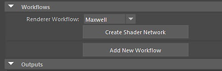

# Maxwell - Substance in Maya

## Substance in Maya Plugin

To render with Maxwell, on the Substance node you can choose the Maxwell render workflow. This will generate all textures and connect them to the Maxwell material.

