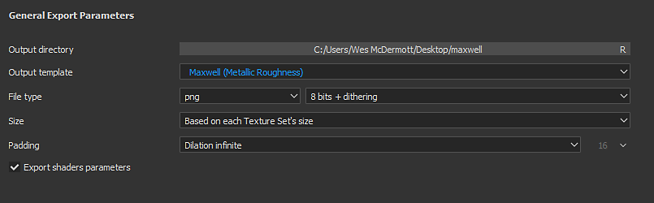
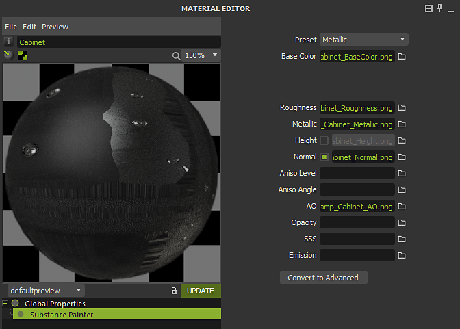

# Maxwell - Substance Painter

Substance Painter 2020.1 (6.1.0) supports Maxwell [Output Templates](https://helpx.adobe.com/substance-3d-painter/getting-started/export.html) for metallic/roughness and specular/glossiness. You can simply export using the Maxwell Output Template**.   
Maxwell 5.1.0** has an integration with Substance Painter that allows you to easily import textures and automatically setup a Maxwell material.

## Exporting textures

You can choose the Maxwell (Metallic Roughness) or Maxwell (Specular Glossiness) Output Templates to export textures for rendering in Maxwell.

{width="500px"}

## Applying Textures in Maxwell

You can use the Substance Painter integration in Maxwell to automatically create a material with the exported maps from Substance Painter applied.   
To begin, right-click in the Material List and choose **New&gt;Substance Painter**.

Browse to the location you exported the Substance Painter textures and select one of the maps such as base color. When you click open, the integration will create a new Maxwell material with the maps assigned.   
If you have multiple texture sets exported from Substance Painter, the integration will use the naming convention for the texture to assign matching texture maps.

{width="600px"}

You can then assign the material to the asset in your scene.

{width="500px"}

All materials applied using the Substance Painter integration.

{width="800px"}
