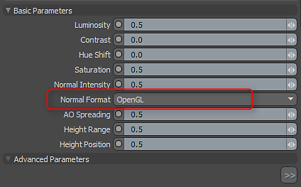
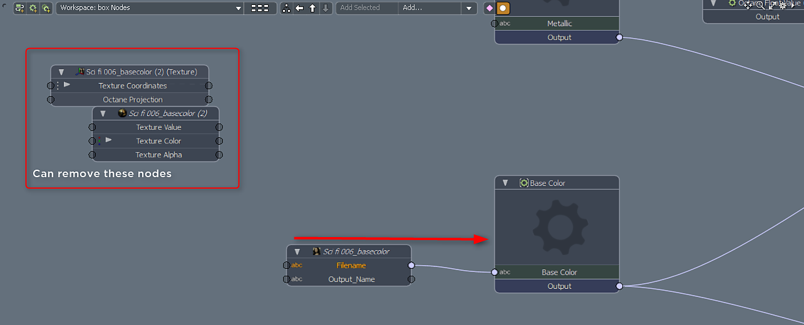
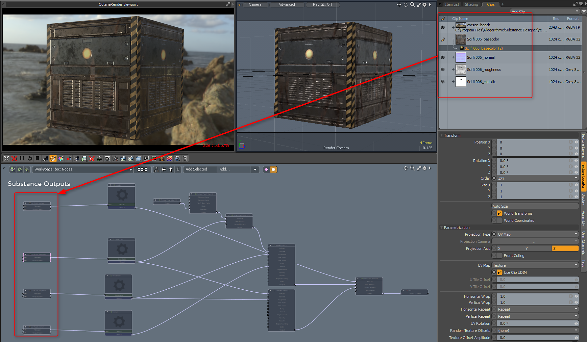

# Octane for MODO

## Substance in MODO Plugin

The Substance outputs work natively with Octane. You can use the following Substance outputs and texture layer effect configurations.

1. Create a Substance&gt;Texture&gt;Create Substance and set the mode to Unreal Material. Using Unreal material will allow you to view the texture in the Advanced OGL viewport.
1. Create outputs for base color, metallic, roughness and normal.
1. MODO uses OGL Normal maps. In the Substance properties, you need to change the normal direction to OpenGL.

   
1. Load the Substance PBR preset. This preset is an Octane Override. Drag it into your shader group.   
     
   [Substance\_PBR.lxp](https://helpx.adobe.com/content/dam/help/en/substance-3d/documentation/integrations/files/162005234/162005272/1/1502792782697/substance-pbr.lxp)
1. Select the override and drag the Substance outputs from the Clip Browser into the Schematic View. Take the node with the filename output and connect it to the appropriate Input Node i.e. base color → base color.

   
1. Hook up the rest of the Substance outputs

   {width="640px"}
