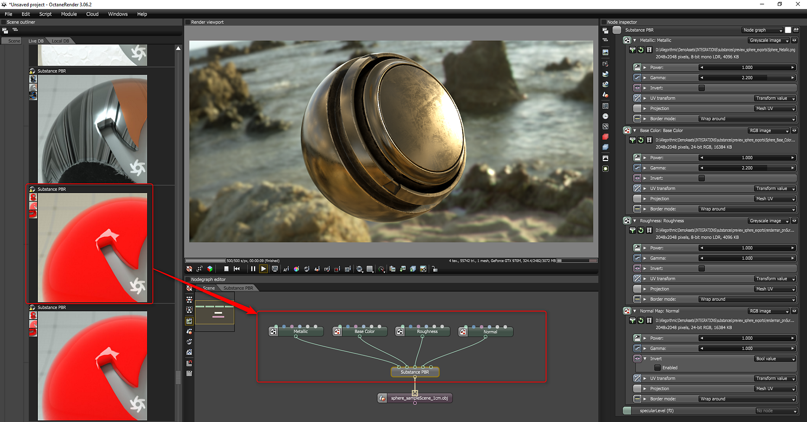

# Octane

Octane can be used to render Substance outputs using the standalone renderer or through the DCC plugins. Through a Live DB Substance material, Octane Standalone supports Substance outputs based on base color, metallic and roughness.

**Octane Standalone**  
Under **Live DB &gt; Materials &gt; Misc** find the "**Substance PBR**" material.

## Table of Contents

* [Octane for 3ds Max](../../renderers/octane/octane-for-3ds-max/octane-for-3ds-max.md)
* [Octane for MODO](../../renderers/octane/octane-for-modo/octane-for-modo.md)
