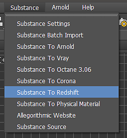

# Redshift for 3ds Max

## Substance in 3ds Max Plugin

The substance plugin supports Redshift via the Redshift render preset. Using this preset will automatically setup the Substance outputs connected to a Redshift material.

