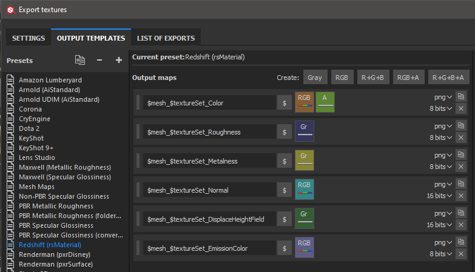

# Redshift - Substance Painter

Substance Painter 2020.1 (6.1.0) supports Redshift [Output Templates](https://docs.substance3d.com/display/SPDOC/Export) for metallic/roughness (rsMaterial). You can simply export using the Redshift template to produce textures that are compatible with Redshift materials.   
  
 

## Redshift Material Setup

| Substance Painter Export | Redshift Material |
| --- | --- |
| Color | Diffuse / Color |
| Roughness | Reflection / Roughness (BRDF = GGX) |
| Metalness | Reflection / Metalness  (Fresnel Type = Metalness) |
| Normal | Overall / Bump Map / rsBumpMap  (Input Map Type = Tangent Space Normal - Height Scale = 1.0) |
| DisplaceHeightField | Displacement Shader / rsDisplacement TexMap (Map Encoding = Height Field) |
| EmissionColor | Overall / Emission  (Emission Weight = 1.0) |

>[!NOTE]
>
> Maps that represent data will need to be interpreted correctly. Please see the [Color Management ](../../color-management/color-management.md)page for more information.

## Maya / Redshift example

{width="800px"}
