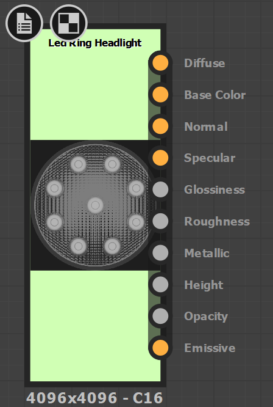
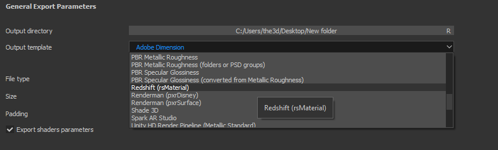

# Renderers

Substance materials provided in [Substance Source](https://source.substance3d.com/) contain outputs for Physically-based shaders and support both the [Metallic/Roughness (default workflow) and Specular/Glossiness workflows](https://academy.substance3d.com/courses/pbrguides). It's important to understand the the workflow your renderer material supports. Depending on the renderer, you may be able to use Substance material outputs directly or you may need to convert the output textures. Custom Substance materials or materials you download from Substance Share may not contain the appropriate outputs needed for a given renderer.

{width="200px"}

For example with Arnold or Vray Next, you can use metallic/roughness outputs directly. However, with Renderman's pxrSurface, the basecolor/metallic outputs need to be converted to diffuse and specular face color. A Substance integration plugin will handle these conversions automatically if the renderer is supported.

With Substance Painter, you can choose an [Output Template](https://helpx.adobe.com/substance-3d-painter/getting-started/export/export-window.html) that will create the appropriate map types needed for a given renderer. If you renderer is not supported by default, you can also create custom Output Templates.  
  
**Substance Painter Output Template**

{width="500px"}

## Renderer Guides

* [Converting Substance outputs](../renderers/converting-outputs/converting-substance-outputs.md)
* [Color Management](../renderers/color-management/color-management.md)
* [Arnold](../renderers/arnold/arnold.md)
* [Vray](../renderers/vray/vray.md)
* [Renderman](../renderers/renderman/renderman.md)
* [Redshift](../renderers/redshift/redshift.md)
* [Maxwell](../renderers/maxwell/maxwell.md)
* [Corona](../renderers/corona/corona.md)
* [Octane](../renderers/octane/octane.md)
* [Keyshot](../renderers/keyshot/keyshot.md)
* [Thea](../renderers/thea/thea.md)
* [Maverick](../renderers/maverick/maverick.md)
* [Toolbag](../renderers/toolbag/toolbag.md)
* [Cycles and Eevee](../renderers/cycles-and-eevee/cycles-and-eevee.md)
