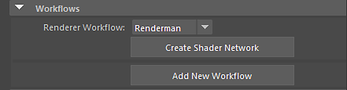

# Renderman for Maya

## Substance in Maya Plugin

The Substance in Maya plugin supports pxrSurface through the Renderman Render Workflow. Using this workflow will create a pxrSurface shader and convert the Substance outputs for use with the material.

