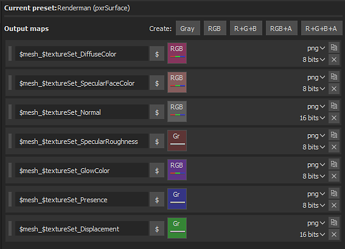

# Renderman - Substance Painter

Substance Painter 2020.1 (6.1.0) supports [**pxrSurface**](https://rmanwiki.pixar.com/display/REN/PxrSurface) and pxrDisney [Output Templates](https://docs.substance3d.com/display/SPDOC/Export).

It is recommend to use **pxrSurface** for the Output.

## Renderman Shader (Maya - RM 23.1)

| Substance Painter Export | PxrSurface |
| --- | --- |
| DiffuseColor | Diffuse / Color |
| SpecularRoughness | Primary Specular / Roughness |
| SpecularFaceColor | Primary Specular / Face Color |
| Normal | Globals / Bump / PxrNormalMap → Orientation (Open GL) |
| Displacement | (red channel ) PxrDispTransform (Result F) → (disp scalar) PxrDisplace (Out Color) → (Displacement Shader) PxrSurfaceSG |
| GlowColor | Glow / Color (Gain = 1.0) |
| Presence | Globals / Presence |

>[!NOTE]
>
> Maps that represent data will need to be interpreted correctly. Please see the [Color Management ](../../color-management/color-management.md)page for more information.
