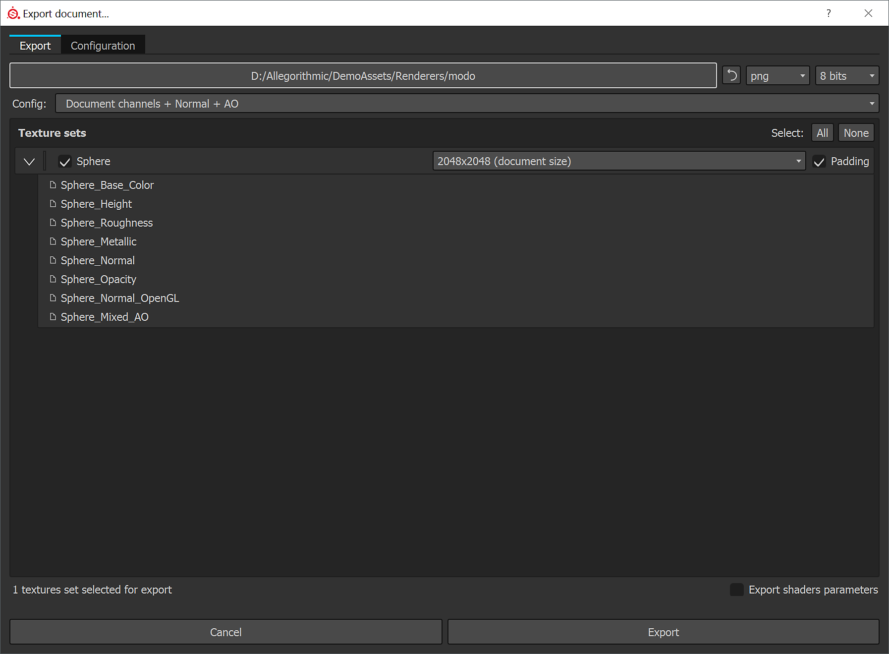
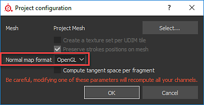
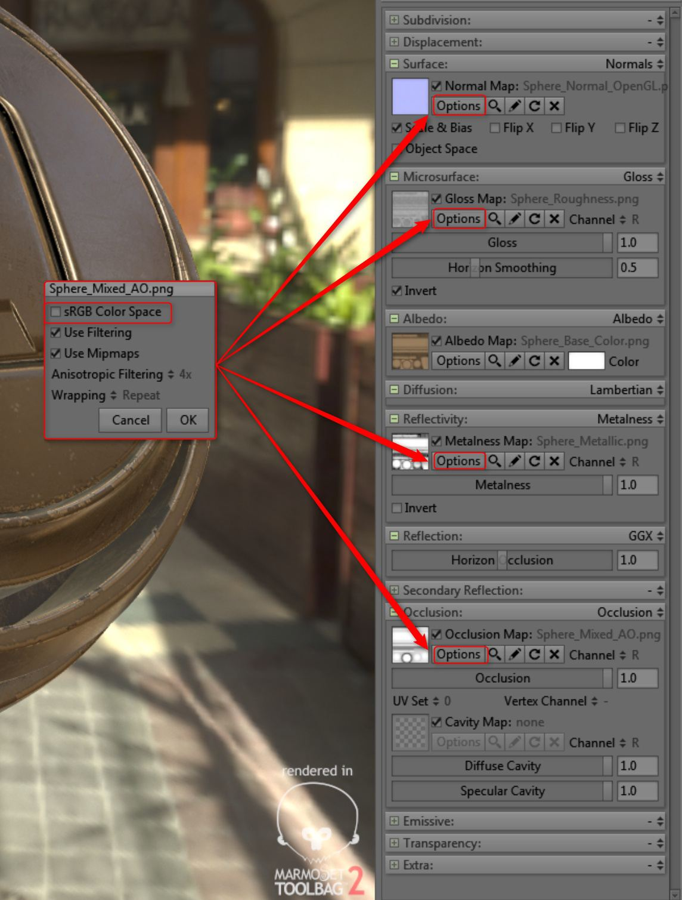

# Toolbag

This page show how to use the roughness/metallic outputs for Toolbag 2.

Toolbag supports both the specular/glossiness and metallic/roughness workflows.

Substance 3D Painter uses the metallic PBR shader as default, however, you can also use with specular/glossiness shader. This workflow will show how to use the metallic outputs for Toolbag 2. Toolbag supports the metallic workflow.

[Download Example Scene](https://www.dropbox.com/s/qyed3un2zhtuibj/toolbag.zip?dl=0)

## Export from Painter

1. When using the default metallic PBR shader, we can export using the default Document channels + Normal + AO export preset.  ***\*Document channels exports Normal Map based on Project Configuration. Toolbag requires OGL Normal map. You can switch the Normal Format in the Project Configuration.***
1. Alternatively, you can create a custom export config that uses glossiness

   {width="600px"}
1. You can change the Normal Format to OpenGL before exporting.  **Edit&gt;Project Configuration**

   

## Material Setup

1. Set Reflectivity to Metalness
1. Set Reflection to GGX
1. Add the textures to the appropriate channels as shown in the following chart:

   | Substance 3D Painter Texture | Colorspace | Toolbag Material |
   | --- | --- | --- |
   | Base Color | sRGB | Albedo |
   | Roughness | sRGB Off | Microsurface - Gloss - Click Invert |
   | Metallic | sRGB Off | Reflectivity - Metalness Map |
   | Normal | sRGB Off | Normal |
   | Ambient Occlusion | sRGB Off | Occlusion |

{width="600px"}
