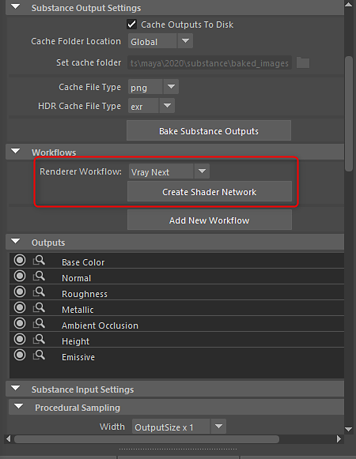

# Vray Next - Substance in Maya

## Substance in Maya Plugin

To render with Vray Next, on the Substance node you can choose the Vray Next render workflow. This will generate all textures and connect them to the VRayMtl material.

