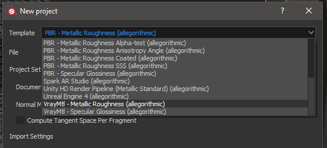
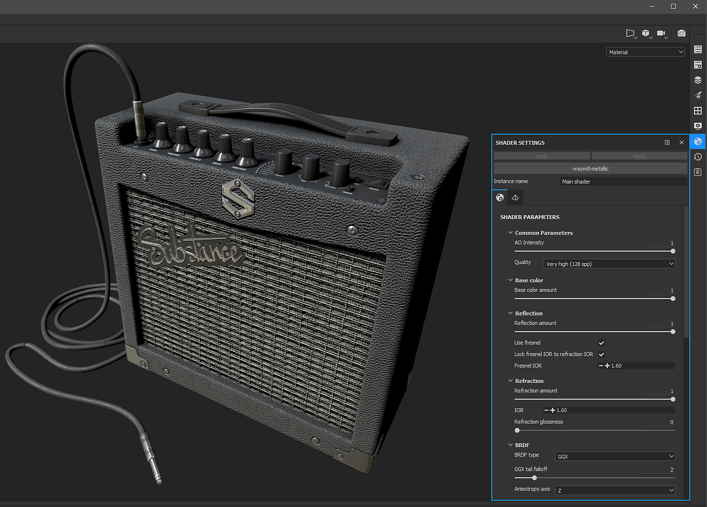
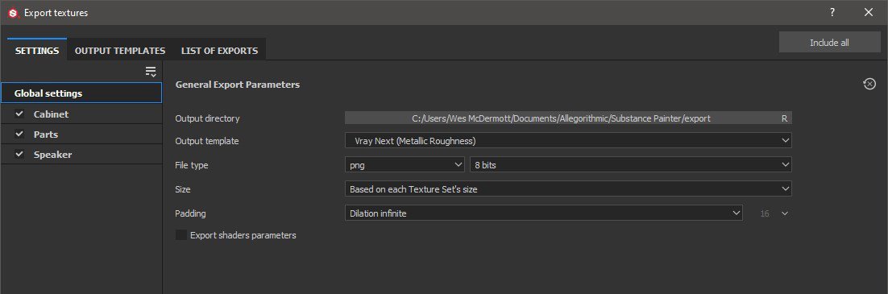
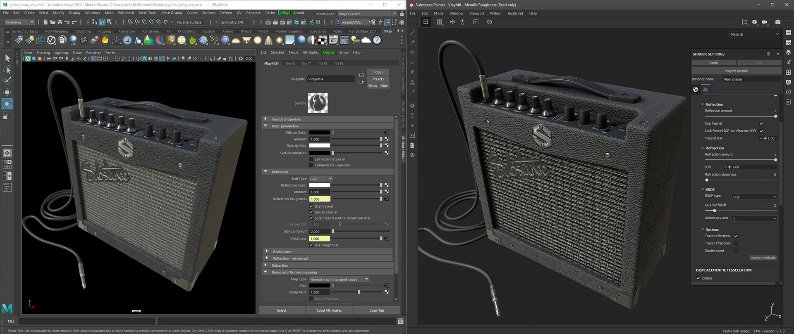

# Vray Next - Substance Painter

Substance Painter 2020.1 (6.1.0) ships with [VrayMtl](https://docs.chaosgroup.com/display/VRAY4MAYA/VRayMtl) shaders for both metallic and specular workflows. You can [setup your Substance Painter project](https://docs.substance3d.com/display/SPDOC/Project+Creation) using the **VrayMtl template**, which will configure your viewport shader.

Under the Shader Settings, you can configure the Vray shader for working with VrayMtl.

>[!NOTE]
>
> If your project was setup to use [UV Tile UDIM Legacy](https://helpx.adobe.com/substance-3d/unlisted/documentation/spdoc/uv-tile-udim-legacy-144310352.html). Use the Vray Next UDIM output template.

{width="800px"}

To export textures for rendering in Vray Next, choose the Vray Mtl Output template.

{width="800px"}

## Vray Material (Vray Next - Metallic/Roughness)

| Substance Painter Export | VRayMtl |
| --- | --- |
| BaseColor | (**Maya**) Diffuse Color (Amount = 1.0) (**3ds Max**) Diffuse |
| Roughness | (**Maya**) Reflection / Roughness (BRDF = GGX) + (Use Roughness enabled)(**3ds Max**) Roughness → BRDF/ Use GGX and enable Use roughness |
| Metallic | (**Maya**) Reflection/ Metalness (**3ds Max**) Metalness |
| Normal | (**Maya**) Bump and Normal Mapping / Map (Map Type = Normal in Tangent Space)(**3ds** **Max**) Bitmap → Normal |
| Height | (**Maya**) Displacement Shader / displacement (**3ds** **Max**) Object modifier → VrayDisplacementMod → Tex Map |
| Emissive | Self-Illumination |
| Transmissive | (**Maya**) Subsurface Scattering / Translucency Color (**3ds Max**) Translucency → Back-side color |
| AnisotropyAngle | (**Maya**) Anisotropy / Anisotropy Rotation (**3ds** **Max**) BRDF / Rotation |
| AnisotropyLevel | (**Maya**) Anisotropy / Anisotropy (**3ds Max**) BRDF / Angle |

## Vray Material (Vray Next - Specular/Glossiness

| Substance Painter Export | VRayMtl |
| --- | --- |
| Diffuse | (**Maya**) Diffuse Color (Amount = 1.0) (**3ds Max**) Diffuse |
| Specular | (**Maya**) Reflection / Reflection Color (Amount = 1.0) (**3ds Max**) Reflect |
| Glossiness | (**Maya**) Reflection / Roughness (BRDF = GGX) + (Use Roughness enabled)(**3ds Max**) Glossiness → BRDF / Use GGX and enable Use glossiness |
| Normal | (**Maya**) Bump and Normal Mapping / Map (Map Type = Normal in Tangent Space)(**3ds** **Max**) Bitmap → Normal |
| Height | (**Maya**) Displacement Shader / displacement (**3ds** **Max**) Object modifier → VrayDisplacementMod → Tex Map |
| Emissive | Self-Illumination |
| Transmissive | (**Maya**) Subsurface Scattering / Translucency Color (**3ds Max**) Translucency → Back-side color |
| AnisotropyAngle | (**Maya**) Anisotropy / Anisotropy Rotation (**3ds** **Max**) BRDF / Rotation |
| AnisotropyLevel | (**Maya**) Anisotropy / Anisotropy (**3ds Max**) BRDF / Angle |

>[!NOTE]
>
> Maps that represent data will need to be interpreted correctly. Please see the [Color Management ](../../color-management/color-management.md)page for more information.

This example show the Substance Painter viewport using the Vray Metallic/Roughness shader and the Vray render using Maya.

{width="800px"}

 